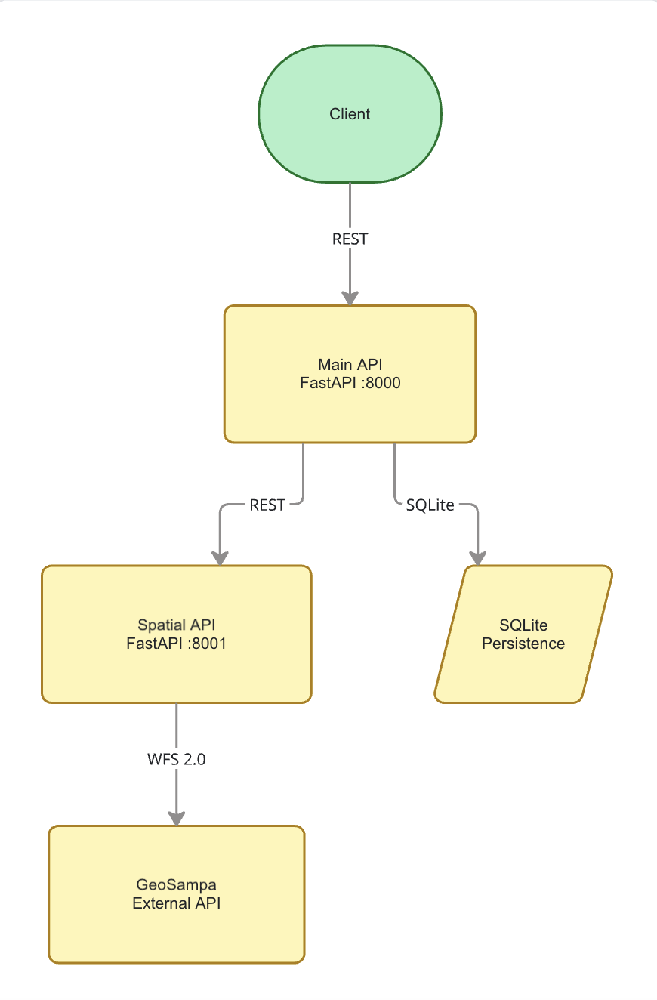

# GeoBuilding SP — Main API

## Overview

GeoBuilding SP is a geospatial MVP that retrieves building footprints from the City of São Paulo's GeoSampa platform for a user-defined area of interest.

The application receives a polygon or multipolygon, communicates with a secondary spatial-processing API, and returns building geometries enriched with cadastral information from active fiscal lots.

The Main API also stores analysis metadata using SQLite, allowing previous analyses to be listed, retrieved, updated, and deleted.

The architecture follows the proposed **Scenario 2.1**, where the Main API operates as an entry point/proxy and communicates with a secondary API responsible for the business logic and external-service communication.

---

## Objective

The objective of this application is to simplify access to GeoSampa geospatial data for a user-defined area.

Given a GeoJSON polygon, the system:

1. receives the area of interest;
2. sends it to the Spatial API;
3. retrieves building footprints from GeoSampa;
4. retrieves active cadastral lots from GeoSampa;
5. spatially associates buildings with cadastral lots;
6. enriches building geometries with cadastral use information;
7. returns the resulting features as GeoJSON;
8. persists analysis metadata in SQLite;
9. saves generated GeoJSON files locally.

A typical use case is obtaining the number and geometry of buildings in a given area and identifying the cadastral use associated with those buildings, such as residential or non-residential use.

---

## Architecture



The system is composed of:

- Main API
- Spatial API
- GeoSampa WFS external service
- SQLite persistence layer

```text
Client
  |
  | REST
  v
Main API
  |
  |---- SQLite
  |
  | REST
  v
Spatial API
  |
  | WFS 2.0
  v
GeoSampa
```

### Main API

The Main API is implemented using FastAPI.

Responsibilities:

- receive requests from the client;
- provide the public REST interface;
- call the Spatial API;
- persist analysis metadata in SQLite;
- provide CRUD operations for saved analyses;
- expose health information.

Default port:

```text
8000
```

Swagger:

```text
http://localhost:8000/docs
```

---

### Spatial API

The Spatial API is responsible for the geospatial business logic.

Responsibilities include:

- validating Polygon and MultiPolygon geometries;
- transforming coordinate reference systems;
- querying GeoSampa WFS;
- retrieving building footprints;
- retrieving cadastral lots;
- filtering active lots;
- calculating spatial intersections;
- associating buildings with cadastral lots;
- calculating overlap ratios;
- assigning cadastral use information;
- classifying match quality;
- saving GeoJSON result files.

Default port:

```text
8001
```

Swagger:

```text
http://localhost:8001/docs
```

---

### SQLite

SQLite is used as the persistence layer of the Main API.

The database stores metadata for each analysis, including:

- analysis ID;
- name;
- description;
- creation date;
- update date;
- status;
- input boundary;
- number of buildings;
- number of matched buildings;
- number of unmatched buildings;
- match percentage;
- analysis summary;
- generated file metadata.

Default database path inside Docker:

```text
/app/data/geobuilding.db
```

The database is mounted to the host through Docker Compose.

---

## External API — GeoSampa

The application uses the GeoSampa Web Feature Service as its external service.

GeoSampa is the geographic information platform of the Municipality of São Paulo.

WFS endpoint:

```text
https://wfs.geosampa.prefeitura.sp.gov.br/geoserver/geoportal/wfs
```

Authentication:

```text
None
```

WFS operation used:

```text
GetFeature
```

Output format:

```text
application/json
```

### Building layer

```text
geoportal:edificacao
```

Relevant attributes include:

```text
cd_identificador
qt_area_projecao_beiral
qt_altura_edificacao
```

### Cadastral lot layer

```text
geoportal:lote_cidadao
```

Relevant attributes include:

```text
cd_identificador
dc_tipo_uso_imovel
nm_logradouro_completo
cd_numero_porta
qt_area_terreno
qt_area_construida
tx_situ_lote
```

Only cadastral lots where:

```text
tx_situ_lote = ATIVO
```

are considered during the spatial association.

Inactive or cancelled lots are excluded.

---

## Building-to-lot matching methodology

The building layer does not always provide a usable cadastral lot identifier.

Therefore, buildings are spatially associated with active cadastral lots.

Workflow:

```text
Building footprint
        |
        v
Find intersecting active cadastral lots
        |
        v
Calculate intersection area
        |
        v
Calculate overlap ratio
        |
        v
Select lot with largest overlap
        |
        v
Assign cadastral information to building
```

The overlap ratio is calculated as:

```text
intersection area / building geometry area
```

Match quality is classified as:

| Overlap ratio | Match quality |
|---|---|
| >= 0.90 | very_high |
| >= 0.75 | high |
| >= 0.50 | medium |
| < 0.50 | low |
| no active lot | unmatched |

---

## Use classification

The property-use classification comes from the active cadastral lot associated with the building.

Examples may include:

```text
Residencial
Não residencial
Terreno
```

Special classifications are used when necessary:

```text
NO_LOT_MATCH
LOT_WITHOUT_USE
```

`NO_LOT_MATCH` means that no active cadastral lot was spatially associated with the building.

`LOT_WITHOUT_USE` means that an active lot was matched but its cadastral use field was empty.

---

## Main API Routes

### GET `/`

Returns general API information.

Example:

```bash
curl http://localhost:8000/
```

---

### GET `/health`

Checks:

- Main API status;
- Spatial API status;
- SQLite database status.

Example:

```bash
curl http://localhost:8000/health
```

Example response:

```json
{
  "main_api": "ok",
  "spatial_api": "ok",
  "database": "ok"
}
```

---

### POST `/analyses`

Creates and executes a new analysis.

Example request:

```json
{
  "name": "Test area",
  "description": "GeoSampa building analysis",
  "boundary": {
    "type": "Polygon",
    "coordinates": [
      [
        [-46.660, -23.560],
        [-46.655, -23.560],
        [-46.655, -23.555],
        [-46.660, -23.555],
        [-46.660, -23.560]
      ]
    ]
  }
}
```

The input geometry is expected in:

```text
EPSG:4326
```

This route:

1. sends the boundary to the Spatial API;
2. executes the spatial analysis;
3. persists the analysis in SQLite;
4. returns the result.

---

### GET `/analyses`

Lists all persisted analyses.

Example:

```bash
curl http://localhost:8000/analyses
```

---

### GET `/analyses/{analysis_id}`

Returns a specific persisted analysis.

Example:

```bash
curl http://localhost:8000/analyses/20260920_145752
```

---

### PUT `/analyses/{analysis_id}`

Updates editable analysis metadata.

Editable fields:

```text
name
description
```

Example request:

```json
{
  "name": "Updated analysis",
  "description": "Updated description"
}
```

The spatial analysis itself is not recomputed.

---

### DELETE `/analyses/{analysis_id}`

Deletes the analysis from SQLite and removes associated result files where available.

Example:

```bash
curl -X DELETE \
  http://localhost:8000/analyses/20260920_145752
```

---

### POST `/analysis`

Legacy alias for:

```text
POST /analyses
```

It is kept for compatibility with earlier development scripts.

---

## Generated files

Generated files are stored in:

```text
results/
```

A successful analysis may create:

```text
20260920_145752_buildings.geojson
20260920_145752_unmatched.geojson
20260920_145752_low_confidence.geojson
20260920_145752_summary.json
```

The files are persisted through a Docker volume.

---

## Coordinate Reference Systems

Input:

```text
EPSG:4326
```

Spatial processing:

```text
EPSG:31983
```

Output:

```text
EPSG:4326
```

Using a projected CRS during spatial processing allows overlap areas to be calculated in square metres.

---

## Installation

### Requirements

- Docker
- Docker Compose
- internet access to GeoSampa

The recommended execution method is Docker.

The Main API and Spatial API repositories should be cloned as sibling directories:

```text
Repos/
├── geobuilding-main-api/
└── geobuilding-spatial-api/
```

---

## Repository structure

```text
geobuilding-main-api/
├── README.md
├── Dockerfile
├── docker-compose.yml
├── .dockerignore
├── .gitignore
├── docs/
│   └── miro_architecture.png
├── main_api/
│   ├── main.py
│   └── requirements.txt
├── tests/
│   └── test_main_api.py
├── data/
└── results/
```

---

## Running with Docker Compose

From the Main API repository:

```bash
docker compose up -d --build
```

Check the running containers:

```bash
docker compose ps
```

Expected containers:

```text
geobuilding-main-api
geobuilding-spatial-api
```

Check the system:

```bash
curl http://localhost:8000/health
```

Swagger:

```text
http://localhost:8000/docs
```

Spatial API Swagger:

```text
http://localhost:8001/docs
```

---

## Docker persistence

SQLite is persisted through:

```text
./data
```

mounted to:

```text
/app/data
```

Generated results are persisted through:

```text
./results
```

mounted to:

```text
/app/results
```

Stopping the containers does not remove persisted data.

---

## Stopping the application

```bash
docker compose down
```

---

## Tests

Quick smoke tests are included for the Main API.

Tests verify:

- the root endpoint;
- the analysis listing endpoint;
- the 404 response for an unknown analysis.

Create and activate a local virtual environment:

```bash
python3 -m venv .venv
source .venv/bin/activate
```

Install dependencies:

```bash
python -m pip install -r main_api/requirements.txt
```

Run the tests:

```bash
python -m pytest -q
```

The tests use temporary local paths instead of Docker paths, so they do not modify the production SQLite database or generated result files.

---

## Technologies

- Python 3.11
- FastAPI
- SQLite
- Requests
- Docker
- Docker Compose
- GeoJSON

The Spatial API additionally uses:

- GeoPandas
- Shapely
- pandas
- PyProj

---

## Notes and limitations

The property-use classification should be interpreted as:

> cadastral use of the active fiscal lot spatially associated with the building.

It is not necessarily an intrinsic attribute of the building footprint itself.

A building may:

- intersect multiple lots;
- have no active lot match;
- have a low overlap ratio;
- match a lot without a use classification.

These cases are explicitly represented in the returned data.

---

## Data source and attribution

This application consumes GeoSampa data produced by the Municipality of São Paulo.

GeoSampa should be credited as the source of the geospatial data used by the application.

---

## Author

MVP developed for a software componentization and web-services assignment.
